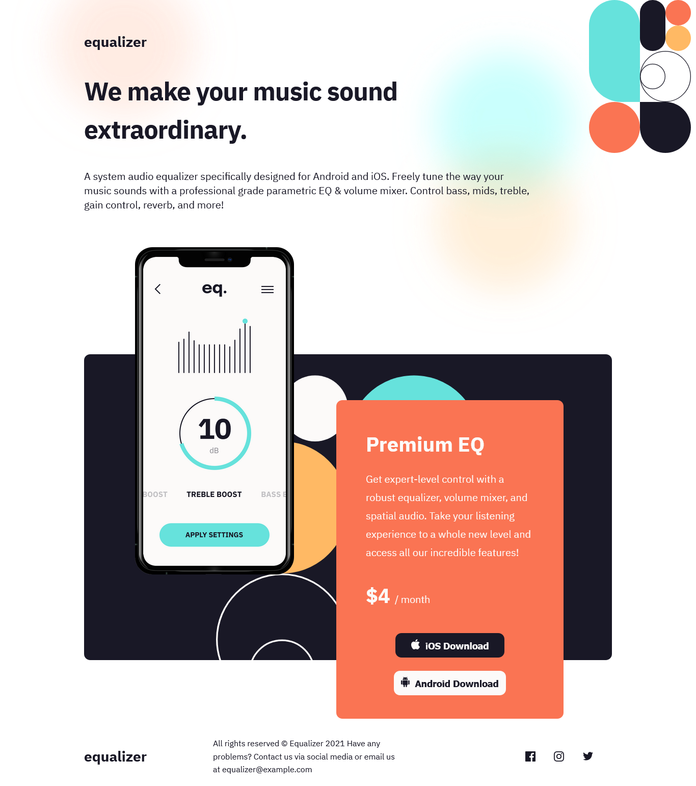
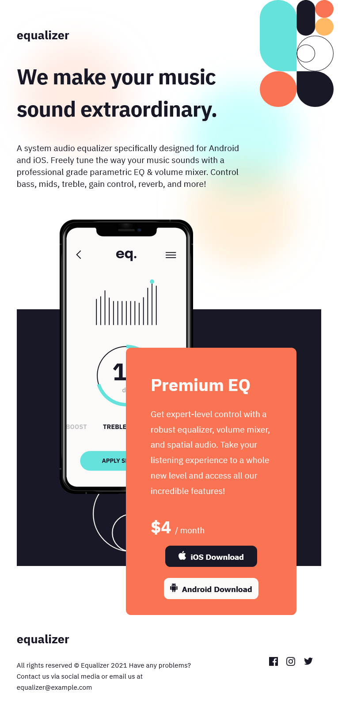
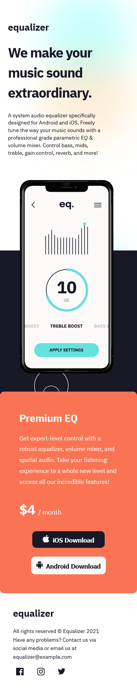

# Frontend Mentor - Equalizer landing page solution

This is a solution to the [Equalizer landing page challenge on Frontend Mentor](https://www.frontendmentor.io/challenges/equalizer-landing-page-7VJ4gp3DE). Frontend Mentor challenges help you improve your coding skills by building realistic projects.

## Overview

The Equalizer landing page challenge is a very interesting challenge for one whose very comfortable with HTML5 & CSS3 and you want to move your game up abit. The Equalizer landing page challenge is a very good challenge to practice better responsive design approaches, folder & file structure, BEM modal for naming classes in your HTML and many more.

### The challenge

Users should be able to:

- View the optimal layout depending on their device's screen size
- See hover states for interactive elements

### Screenshot

- Desktop view
  

- Tablet view
  

- Mobile view
  

### Links

- Solution URL: [Add solution URL here](https://your-solution-url.com)
- Live Site URL: [Add live site URL here](https://your-live-site-url.com)

## My process

- I began the Equalizer landing page challenge by cleaning up the index file and placing text in the right semantic tags to render the page correctly and also improve on the site SEO.

- I split up my CSS file & organised it into different separate files well known as partial files and imported all of them into one CSS file using a popular pattern known as the 7 - 1 pattern of file & folder structure.

- I finally wrote my CSS to get the web page layout looking as close to the figma design as possible, then alternated from the desktop view all the way to the mobile view

### Built with

- Semantic HTML5 markup
- CSS custom properties
- CSS partials & imports
- BEM modal
- Flexbox

### What I learned

I managed to learn various advanced ways to control backgrounds with gradients, images & text.

## Author

- Frontend Mentor - [@ssembatya-dennis](https://www.frontendmentor.io/profile/ssembatya-dennis)
- Twitter - [@DennisSsembatya](https://twitter.com/DennisSsembatya)
